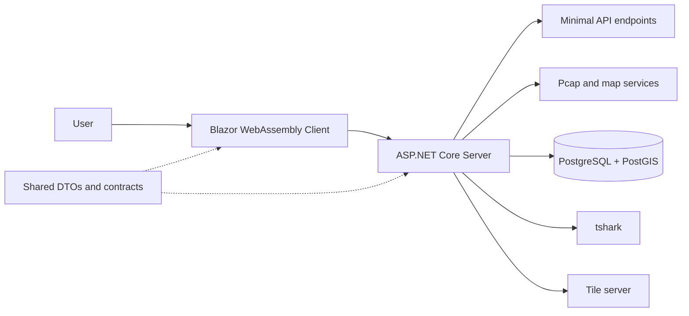
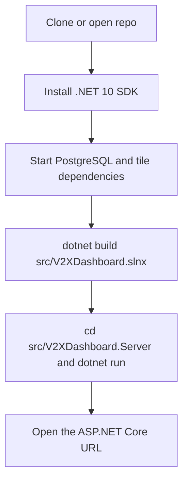

# V2X PCAP Dashboard

V2X PCAP Dashboard is a full-stack .NET 10 application for ingesting V2X PCAP captures, decoding message families, storing normalized results in PostgreSQL/PostGIS, and exploring data through APIs and a Blazor WebAssembly UI.

## Features

- PCAP ingestion for single files or all available files.
- Packet extraction through tshark.
- Decoding and storage of V2X message families:
	- CAM
	- DENM
	- MAPEM
	- SPATEM
	- SREM
	- SSEM
- OBU-RSU correlation workflow.
- Tile-based map visualization and cache diagnostics endpoints.
- MudBlazor dashboard for operations and analytics.

## Architecture



- Server: ASP.NET Core minimal APIs and static hosting for Blazor assets.
- Client: Blazor WebAssembly + MudBlazor UI.
- Shared: DTOs and contracts used by both server and client.
- Data access: Dapper with PostgreSQL (PostGIS enabled).
- Packet parsing: tshark invoked by server-side services.

## Local Development Setup

Use this path when you want to run the app directly from source instead of the container image.



1. Install the prerequisites:

- .NET 10 SDK
- Docker and Docker Compose
- tshark on the host if you plan to ingest PCAPs outside the web container

2. Start the infrastructure:

```bash
docker-compose up -d
```

This starts the database, pgAdmin, web container, and tile server.

3. Build the solution:

```bash
dotnet build src/V2XDashboard.slnx
```

4. Run the server project:

```bash
cd src/V2XDashboard.Server
dotnet run
```

5. Open the application:

- The app URL is printed by the ASP.NET Core host.
- Swagger is available only when `ASPNETCORE_ENVIRONMENT=Development`.

## Repository Structure

```text
.
|- src/
|  |- V2XDashboard.Server/        # Minimal APIs, services, repositories
|  |- V2XDashboard.Client/        # Blazor WebAssembly UI
|  |- V2XDashboard.Shared/        # Shared DTO/models
|  |- V2XDashboard.Server.Tests/  # xUnit tests
|  \- V2XDashboard.slnx
|- docker/
|  |- postgres/                   # Postgres + PostGIS init
|  |- pgadmin/                    # pgAdmin bootstrap config
|  \- web/                        # App container with tshark
|- PcapData/                      # Sample/input PCAP captures
|- tiles/                         # Tile server data and style files
\- scripts/                       # Utility scripts
```

## Prerequisites

For local development:

- .NET 10 SDK
- Docker + Docker Compose
- tshark installed on host (required when ingesting outside the web container)

Optional for script usage:

- Python 3 (for scripts in `scripts/`)

## Quick Start (Docker First)

1. Start infrastructure and services:

```bash
docker-compose up -d
```

2. Open services:

- App: http://localhost:8080
- pgAdmin: http://localhost:5050
- Tile server: http://localhost:8081

Docker compose includes:

- `db` (PostgreSQL + PostGIS)
- `pgadmin`
- `web` (server/client app, includes tshark)
- `tileserver`

If you are running from source, use the Local Development Setup section above.

## Configuration

Primary server settings are in:

- `src/V2XDashboard.Server/appsettings.json`
- `src/V2XDashboard.Server/appsettings.Development.json`

### Connection String

- Development example uses localhost:
	- `Host=localhost;Port=5432;Database=v2x_database;Username=v2x_admin;Password=...`
- Docker web container overrides host to `db` via environment variable:
	- `ConnectionStrings__DefaultConnection=Host=db;...`

### PCAP Path

- Base config: `PcapDataPath` = `./PcapData`
- Development config: `PcapDataPath` = `../../PcapData`
- Service fallback if setting is missing: `/app/PcapData`

### Scheduler

- Config section: `Ingestion:Scheduler`
- Key options:
	- `Enabled`
	- `IsSchedulerNode`
	- `IntervalSeconds`

### Map Configuration

Config section `MapConfig` provides:

- `TileStyleUrl`
- default center coordinates
- default/min/max zoom

Default style endpoint points to:

- http://localhost:8081/styles/basic-preview/style.json

### Tile Diagnostics Endpoint

Tile diagnostics are enabled when:

- environment is Development, or
- `TileDiagnostics:Enabled=true`

## API Overview

Endpoint groups are mapped under:

- `/api/ingestion`
- `/api/packets`
- `/api/messages`
- `/api/correlations`
- `/api/map`
- `/api/stations`
- `/api/tiles`

Examples:

- `GET /api/ingestion/files`
- `POST /api/ingestion/process/{fileName}`
- `POST /api/ingestion/process/all`
- `GET /api/messages/counts`
- `GET /api/map/config`
- `GET /api/tiles/{layer}/{z}/{x}/{y}`

Swagger UI is available only in Development:

- `/swagger`
- spec endpoint: `/swagger/v1/swagger.json`

## Database

Schema bootstrap lives in:

- `docker/postgres/init.sql`

Highlights:

- Enables `postgis` and `postgis_topology` extensions.
- Creates packet/message/correlation related tables.
- Includes migration-safe `ALTER TABLE ... ADD COLUMN IF NOT EXISTS ...` statements.

## Testing

Test project:

- `src/V2XDashboard.Server.Tests`

Run tests:

```bash
dotnet test src/V2XDashboard.Server.Tests/V2XDashboard.Server.Tests.csproj
```

Stack:

- xUnit
- Microsoft.NET.Test.Sdk
- coverlet.collector

## Build

Build everything:

```bash
dotnet build src/V2XDashboard.slnx
```

## Troubleshooting

- Missing `DefaultConnection` causes startup/runtime failures in persistence-dependent services.
- Missing/invalid `PcapDataPath` results in no discoverable files for ingestion.
- Swagger not visible: check `ASPNETCORE_ENVIRONMENT=Development`.
- Running locally vs Docker uses different DB host values (`localhost` vs `db`).
- If ingestion fails outside Docker, ensure host `tshark` is installed and accessible.

## Using .github/agents

This repository includes specialized Copilot agent definitions in `.github/agents`:

- `CSharpExpert.agent.md`
- `dotnet-self-learning-architect.agent.md`
- `v2x-implementation-reviewer.agent.md`
- `dapper-sql-reviewer.agent.md`

Recommended usage patterns:

- Use `C# Expert` for implementation tasks in server/client/test projects.
- Use `.NET Self-Learning Architect` for larger, multi-step changes and architecture planning.
- Use `V2X Implementation Reviewer` for V2X-focused review of API/service/UI/data-boundary quality.
- Use `Dapper SQL Reviewer` for SQL safety and PostgreSQL correctness checks in repository layer changes.

## Development Notes

- Follow guidance in `.github/copilot-instructions.md` and `.github/instructions/*` for endpoint, service, and client conventions.
- Keep interfaces and service registrations aligned when introducing new dependencies.
- Use parameterized SQL and keep PostgreSQL `RETURNING` after `VALUES` for insert-return patterns.
